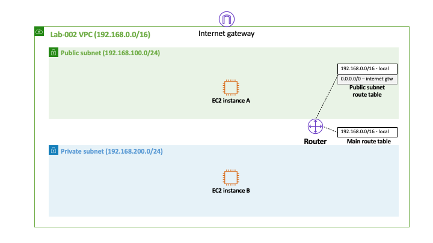

# Lab-002

## Accessing an EC2 Instance in a Private Subnet from an Internet Host

Difficulty Level: 1

Creation Date: June 9, 2020

Original Author(s): [Thyago Mota](https://github.com/thyagomota)

Contributor(s): [João Marcelo](https://github.com/jmhal)

## Goal
The goal of this lab is to demonstrate how to access a Linux EC2 instance launched in a private subnet from a internet host via SSH.

## Architecture Diagram


## Overview

In order to achieve the goal of this lab, you will have to go through the following steps:

1. Create a new VPC with the *Name tag* lab-002 and the *IPv4 CIDR block* 192.168.0.0/16.

[lab-002-scrn-01](images/lab-002-scrn-01.png)
[lab-002-scrn-02](images/lab-002-scrn-02.png)
[lab-002-scrn-03](images/lab-002-scrn-03.png)

2. Create an [Internet gateway](https://docs.aws.amazon.com/vpc/latest/userguide/VPC_Internet_Gateway.html) with the *Name tag* lab-002 and attach it to lab-002 VPC.
3. Create a public subnet on lab-002 with the *Name tag* public and *IPv4 CIDR block* 192.168.100.0/24.  
4. Enable *Auto-assign IPV4* in the newly created public subnet.
5. Edit the route table of the public subnet adding a default route to *Internet gateway* lab-002.
6. Create a private subnet on lab-002 with the *Name tag* private and the *IPv4 CIDR block* 192.168.200.0/24.
7. Launch two EC2 instances using the procedure described in [lab-001](../lab-001); make sure that each subnet has one of the instances.

Note that the EC2 instance that you will create in the public subnet (labeled as A in the diagram) is necessary so you can later connect to the EC2 instance in the private subnet (labeled as B in the diagram).  EC2 A is normally called *bastion host* or *jump host*.  

## Test
1. First add the EC2 key pair into your local ssh authentication agent using:

```
ssh-add -K lab-002.pem (macos)
ssh-add -c lab-002.pem (linux)
```

2. Then connect to the EC2 instance A but with ssh agent forwarding enabled:  

```
ssh -A ec2-user@<public-IP of A>
```
3. Finally, from EC2 instance A ssh to the EC2 instance B using its private IP address:

```
ssh <private-IP of B>
```
