# Lab-006

## A Simple EC2 Auto Scaling

Difficulty Level: 1

Creation Date: June 14, 2020

Original Author(s): [Thyago Mota](https://github.com/thyagomota)

Contributor(s): [João Marcelo](https://github.com/jmhal)

## Goal
This lab goal is to illustrate how to setup a simple EC2 auto scaling service. You will create an auto scaling group with initially only one EC2 instance running. But you will create a rule that will automatically launch a second EC2 instance when the CPU usage of the first instance reaches 75%.

## Architecture Diagram


## Overview
The EC2 Auto Scaling service enables automatically launching EC2 instances based on pre-defined conditions named *scaling policies*. A common scenario for auto scaling is launching more instances to cope with a sudden demand increase, for example. Two concepts are key to understand how AWS auto scaling works:

* Launch Configurations: it allows creating EC2 configurations so the service knows what type of EC2 instance to create when needed; and
* Auto Scaling Groups: a logical group of EC2 instances controlled by the auto scaling service.

Begin this lab by running steps 1-3 of [lab-005](../lab-005), making sure to replace any references to lab-005 with lab-006. Then follow the steps described next.

### Step 1 - Create a Launch Configuration


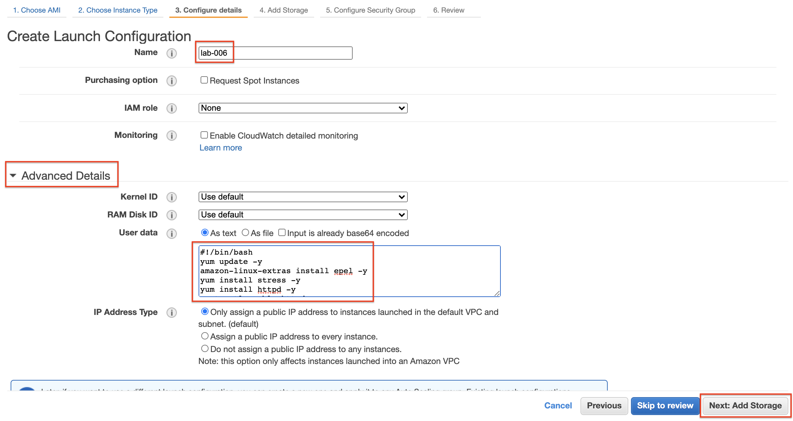
Get the user data script [here](files/user-data.sh) which will install a stress tool and launch an Apache web server.
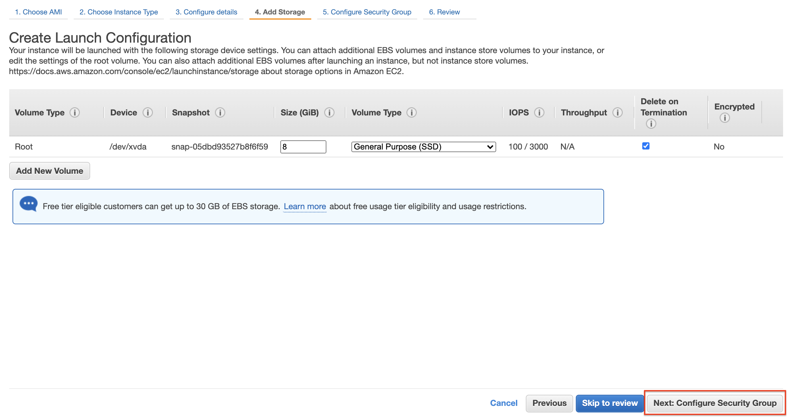
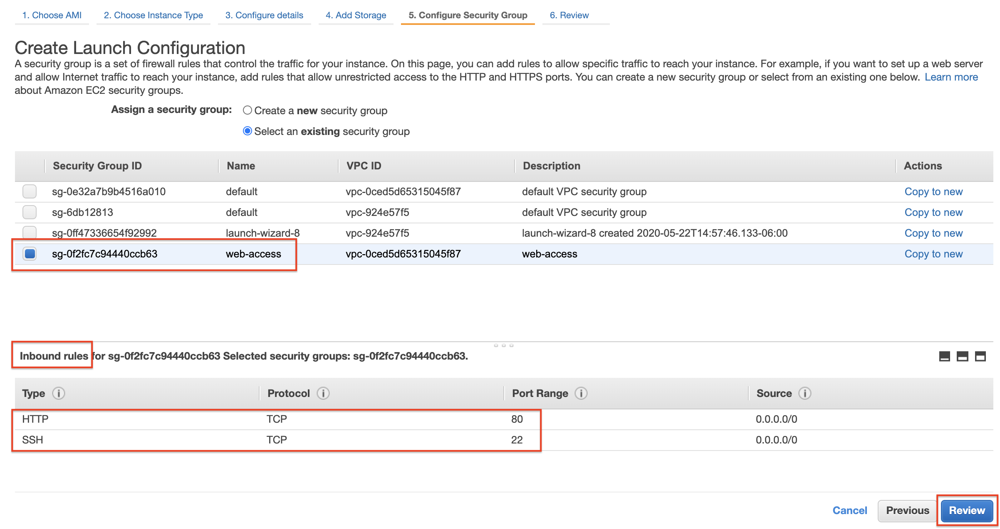


### Step 2 - Create an Auto Scaling Group

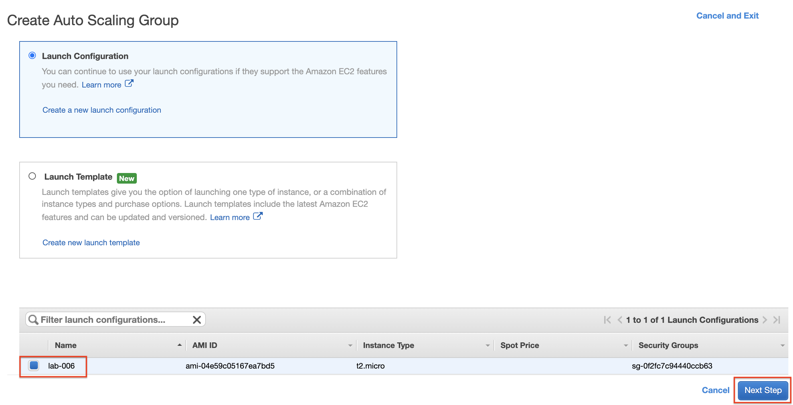
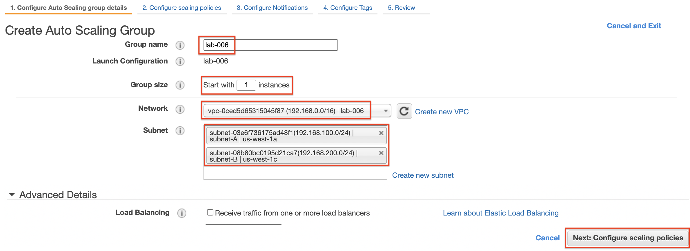
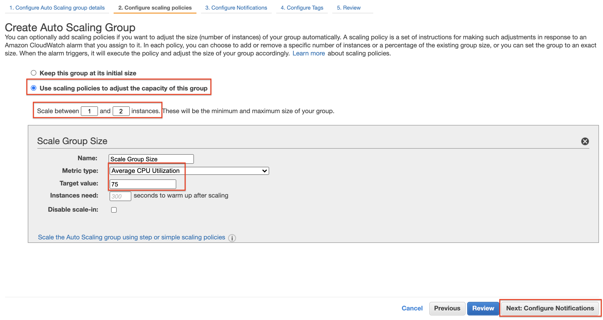
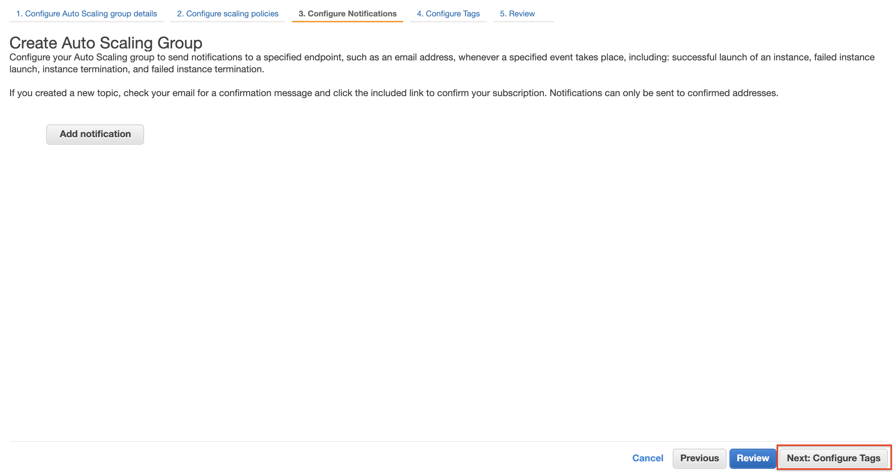
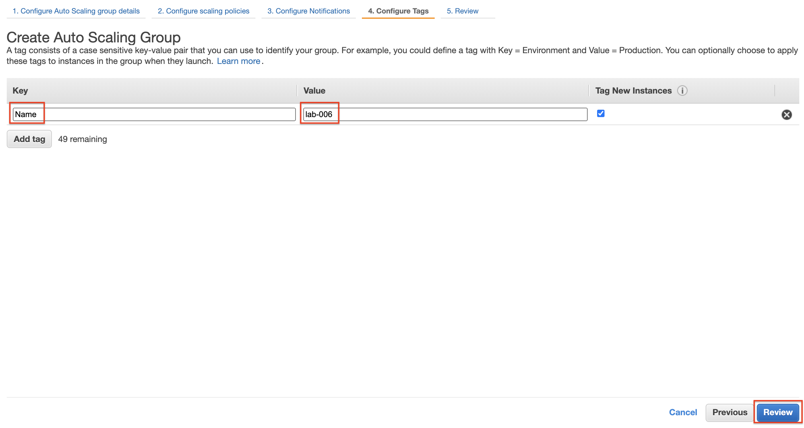
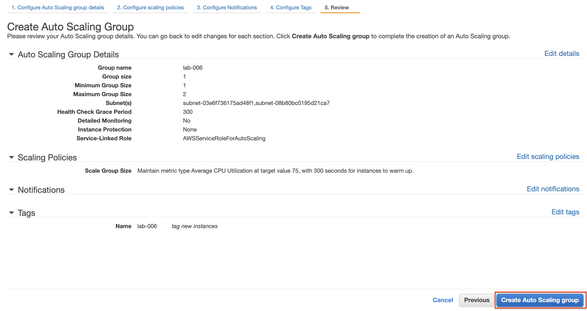


## Test and Validation
The EC2 Auto Scaling service must automatically launch one EC2 instance based on the EC2 launch configuration that you created. Connect to this instance through SSH and run the following commands to artificially increase CPU utilization.

```
stress -c 200
```

You can then begin monitoring the instance's CPU utilization increase and verify than when it reaches 75% or above a new EC2 instance will automatically be launched by the auto scaling service.

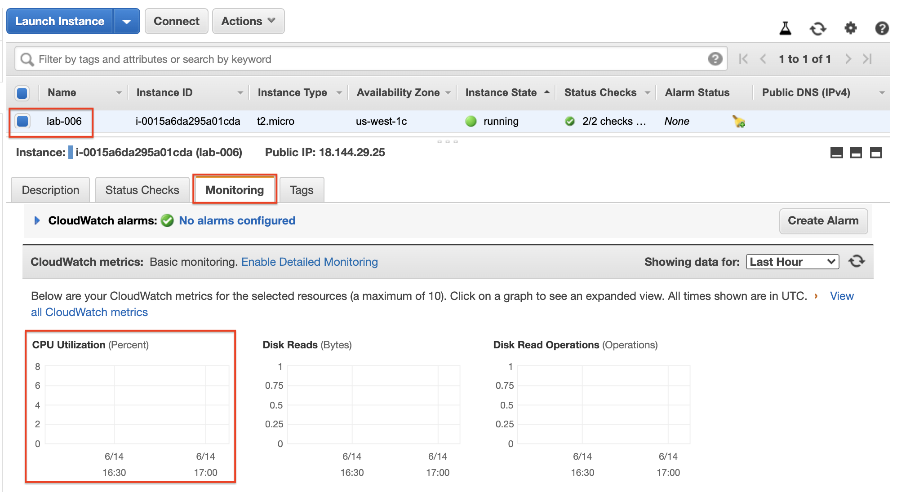
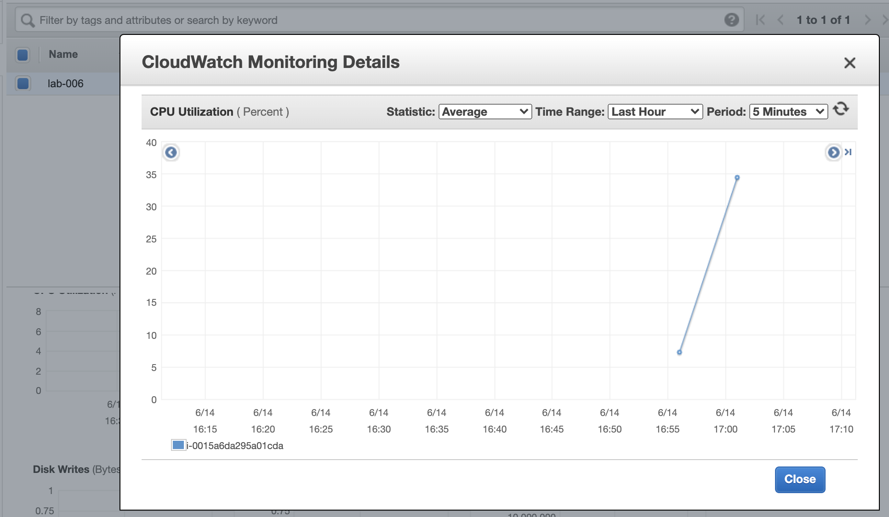
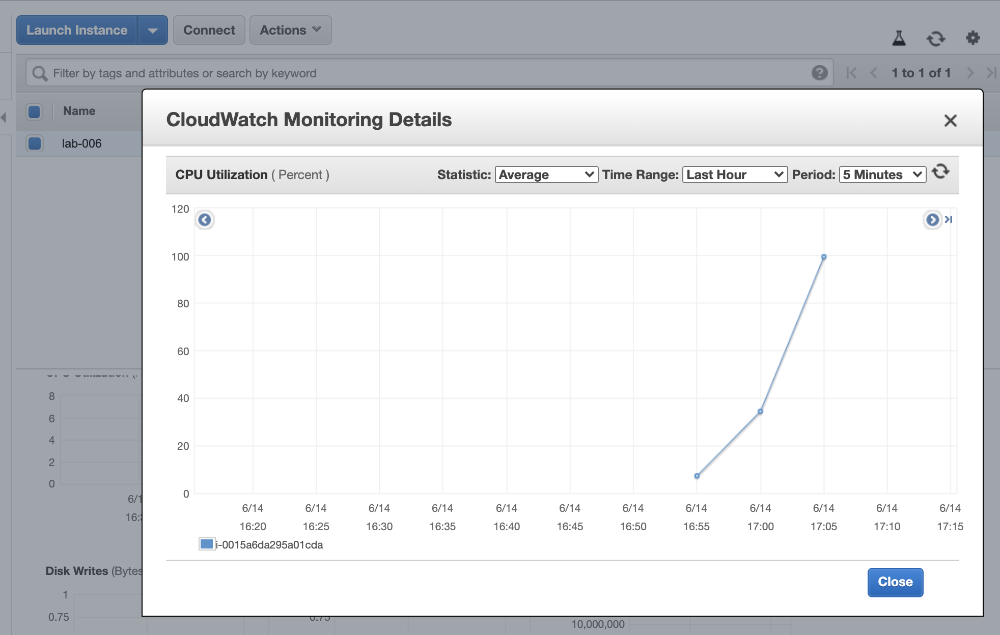

