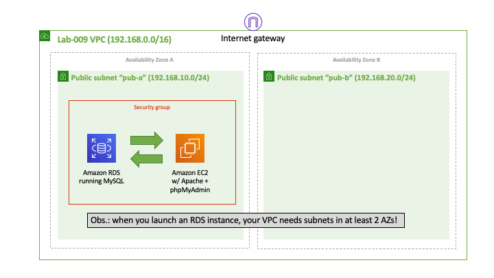

# Lab-009

## Standalone RDS Instance Running MySQL

Difficulty Level: 2

Creation Date: June 21, 2020

Original Author(s): [Thyago Mota](https://github.com/thyagomota)

Contributor(s):

## Goal
This lab illustrates how to launch a standalone RDS instance running a MySQL database. An EC2 instance will also be launched to allow access to the database using phpMyAdmin.

## Architecture Diagram

## Overview
The Amazon Relational Database Service (Amazon RDS) offers a managed database service.  In this lab we will be configuring RDS to use MySQL, an open source database. For simplicity, we will not configure more advanced features available in RDS, such as multi-az deployment or read replicas. To verify that RDS is working, we will configure an EC2 instance with Apache and phpMyAdmin, a free software tool written in PHP that simplifies administration of a MySQL database over the Web.

### Step 1 - Create a Custom VPC with Two Public subnets

Configure an internet gateway on your custom VPC. Make sure there is a default route for the internet gateway. Finally, make sure your public subnets are configured in distinct AZs and that auto-assign IPv4 is enabled.

### Step 2 - Launch an RDS Instance

Below are some of the main options you should select:
* Database creation method: Standard Create
* Engine option: MySQL
* Templates: Free tier
* DB instance identifier: lab-009
* Master password: 12345678
* DB instance size: Standard classes
* Storage: default options are fine
* Multi-az deployment: if you selected the free tier template you should not even be able to select multi-az deployment options
* Connectivity: set the VPC where the RDS instance will run and in the additional connectivity configuration, VPC security group, choose *Create new* and name it *lab-009sg*; also select the availability zone suffixed with 1a (or the first option that appears to you)
* Additional configurations: set the initial database name to lab009, disable automatic backups

## Test and Validation
Provide some guidance on how to test the lab and validate whether it is doing what is suppose to do.
